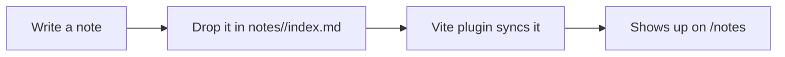

This is the first post in my notes section. Notes live in `notes/<slug>/index.md` in the repo,
each in its own folder so images, diagrams, or any other media can sit right next to the post
that uses them.

## Code blocks get syntax highlighting

```js
function greet(name) {
  return `Hello, ${name}!`
}
```

## Diagrams

Fenced ` ```mermaid ` blocks render as actual diagrams instead of raw text:



That's the whole pipeline - write markdown, save the file, see it live.
